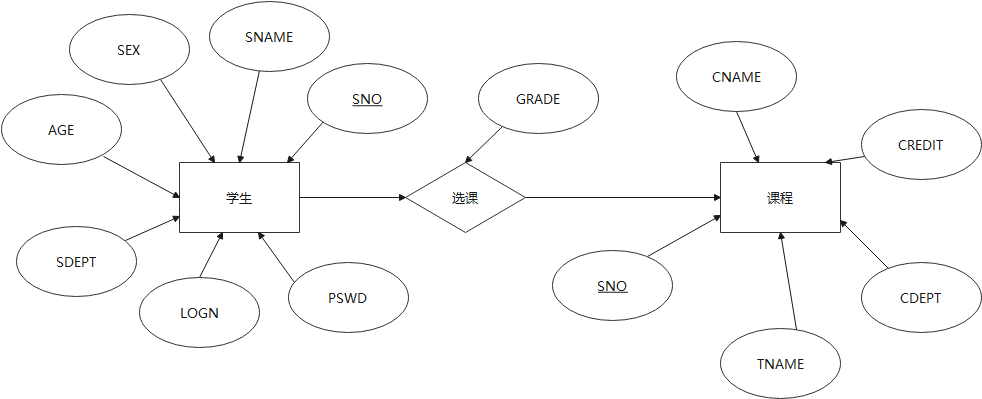
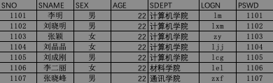
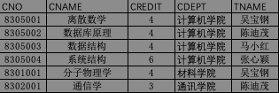
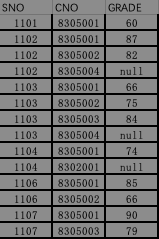
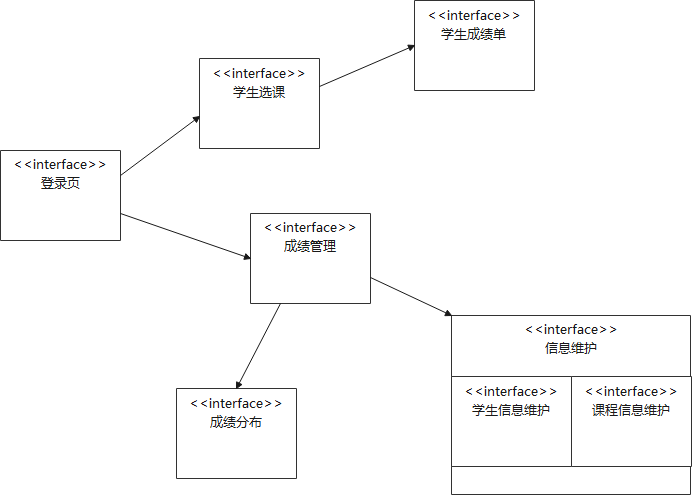
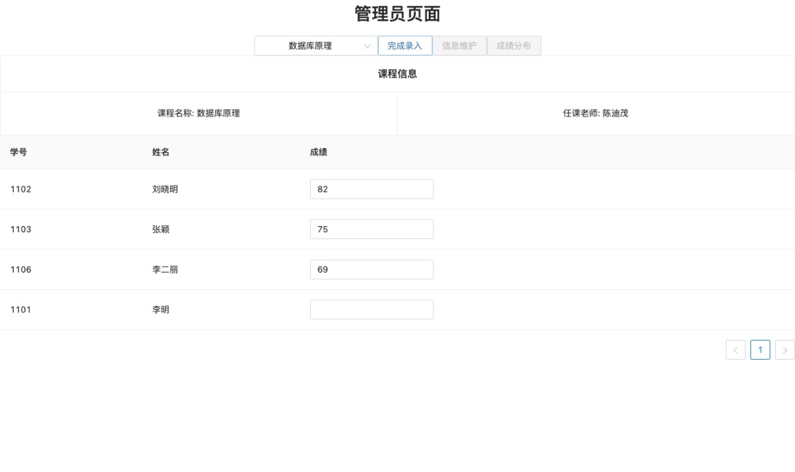
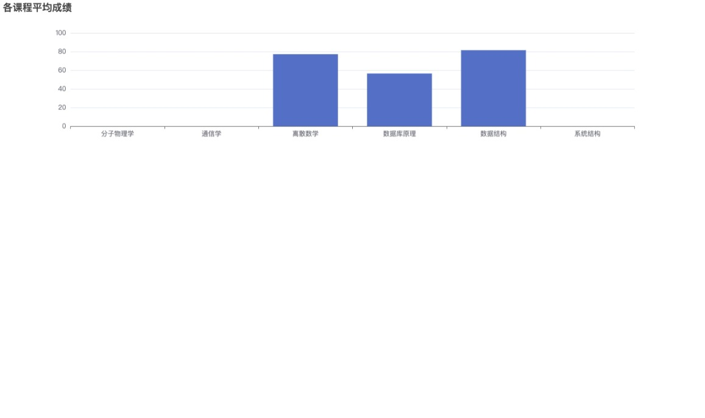

# <center>《数据库》课程大作业项目报告
## 项目概述
1. **项目背景**
   本项目是完成《数据库》教程要求作业之一,要求运用所学知识搭建一个选课系统
2. **项目目的**
   考察课堂内外知识的掌握程度
   锻炼应用数据库相关知识构建实际项目的能力
3. **项目要求**
   1. 一个包含学生和管理员两种角色的选课平台
      1. 每个学生可以通过已有、个人独立的账户进行登陆
      2. 学生可以查看个人基本信息、选课信息、以及已修课程信息
      3. 学生可以完成选课、退课等操作
      4. 管理员可以通过专门的管理员账户进行登陆
      5. 管理员可以查看所有的选课信息、以及成绩分布
      6. 管理员可以查看选课情况,并且录入没门课程学生的成绩
      7. 管理员可以查看和修改学生和课程信息
   2. 要求包含以下七个页面:
      1. 登陆页面
      2. 学生选课页面
      3. 学生成绩单页面
      4. 成绩管理页面
      5. 学生信息维护页面
      6. 课程信息维护页面
      7. 成绩分布页面
   3. 详细要求
   更多详细要求,参见课本《数据库实用教程》(董健全等)实验五(P311)
4. **相关平台、技术**
由于项目平台架构不做要求,所以学生并没有采用课本实例采用的PowerBuild 构建,而是采用了BS架构来进行构建,详情如下:
- 数据库
  - 数据库软件: SQL Server 2019
  - 数据库管理软件: Microsoft SQL Server Management Studio
- 后端服务器
  - 服务器框架: Uvicorn + FastAPI
  - 数据库驱动: pymssql
- 前端应用
  - 前端应用程序框架: React + Redux
  - UI库: Ant Design 


## 项目内容

### 总体概况
本项目总体上是基于 React 框架上 单页应用程序 (SPA), 整个应用的运行逻辑部分代码主要集中在前端部分,后端主要提供数据存储支持.
可将后端进一步划分服务器和数据库两部分,其中服务器部分主要作用是抽象应用所有需要访问数据的操作为接口,供前端应用调用.
接下来分别按照 数据库设计、后端、前端三部分进行介绍

### 数据库设计
1. 关系模型
项目中涉及到两类实体:学生和课程,两类实体之间以选课关系连接,可作实体关系图如下:



其中两个实体之间是 1 对 N 连接,所以考虑建立如下三个表
S (<u>SNO</u>,SNAME,SEX,AGE,SDEPT,LOGN,PAWD)
C (<u>CNO</u>,CNAME,CREDIT,CDEPT,TNAME)
SC (<u>SNO</u>,<u>CNO</u>,GRADE)

2. 模拟数据 
   - S表
  
   - C表
  
   - SC表
  


### 后端设计与实现

1. API 设计
学生和管理员进行各种操作过程种有13种不同的访问操纵数据的方式,可以抽象为13种不同的API,这13个API的设定如下表所示.


2. 数据模型
   为了方便前后端数据交互,还需要设计如下主要四种数据模型:
   1. Student 
      - 模型:
      > class Student(BaseModel):
         sno: str
         sname: Optional[str]
         sex: Optional[str]
         age: Optional[str]
         sdept: Optional[str]
         logn: Optional[str]
         grade: Optional[float]  
      - 描述:
      主要用于传递单个或者多个学生数据,主要用于展示学生个人主页,维护学生信息等操作
   2.  Course
       - 模型
       >class Course(BaseModel):
         cno: str
         cname: Optional[str]
         credit: Optional[int]
         cdept: Optional[str]
         tname: Optional[str]
         grade: Optional[float]  
      - 描述:
      用于传递单个或者多个课程信息,主要用于维护课程信息以及选退课时 
   3. CourseWithStudents
      - 模型
       >class CourseWithStudents(BaseModel):
         course: Course
         students: List[Student] 
      - 描述:
      用于表示一门课程与多个学生之间的映射关系,主要用于获取所有课程数据,以及录入修改学生信息
   4. StudentWithCourses
      - 模型
       >class StudentWithCourses(BaseModel):
         student: Student
         courses: List[Course]
      - 描述:
      用于表示一个学生与多门课程之间的映射关系,选退课操作
   5. Respond
      - 模型
       >class Respond(BaseModel):
         flag: bool = True
         msg: Optional[str]
      - 描述:
      通用回复模型,表明提交操作的状态


3. 数据库连接
   本项目采用 pymssql 连接驱动项目,主要连接、查询操作如实例代码所示

   ```python
   # 建立连接
   conn = pymssql.connect(host="192.168.31.249", 
               user='sa',
               password='lin12345678'
               database='DBforpProject', 
               charset='utf8')

   # 获取设定游标
   cursor = conn.cursor(as_dict=True)

   # 编写 SQL 语句
   sql = 'select * from s'

   # 执行SQL语句
   cursor.execute(sql)

   # 获取所有查询结果
   rs = cursor.fetchall()

   # 如果有进行修改的话需要 进行 commit
   conn.commit()
   ```

4. API 实现
   API的编写实现是借助FastAPI完成的,实例API实现代码如下:
   ```python
   @app.get("/API/cws/", 
   response_model=List[CourseWithStudents])
   async def getAllCousWS():
      # 载入 Course
      courses = []
      # 初始化 SQL
      sql = '''
         SELECT *
         FROM C
      '''

      # 执行 SQL 并获取结果
      cursor.execute(sql)
      rs = cursor.fetchall()

      # 将结果 模型化并返回
      res = []
      if rs is not None:
         for i in rs:
               res.append(Course(**i))

      # 将 course list 转变为 Cws list
      cous = []
      for item in res:
         cous.append(
            CourseWithStudents(
               course=item,
               students=[]))

      # 载入 Students
      for item in cous:
         # 初始化 SQL
         sql = '''
               SELECT S.sno, sname, 
               sex, age, sdept, logn , grade
               FROM S, SC
               WHERE S.sno =SC.sno
                  AND SC.cno = %s
         ''' % (item.course.cno)

         # 执行 SQL 并获取结果
         cursor.execute(sql)
         rs = cursor.fetchall()

         # 将结果 模型化并返回
         if rs is not None:
               for i in rs:
                  item.students.
                  append(Student(**i))

      # 返回 Cws
      return cous
   ```

### 前端设计与实现

1. 页面关联设计
   七个页面之间的关联关系如下
   

2. MVVM模型 和 DVA 模型
   1. MVVM 模型
    MVVM模型是基于 基础的GUI模型 MVC(数据模型、视图、控制) 发展而来的,其中M 表示 modle,为数据模型.V为 View 是视图,而 VM 则是View-Modle, 实现视图和数据模型绑定的部分.通过实现双向绑定,在数据发生变化时,页面会重新渲染;同理页面交互的触发也会响应地更改数据.
   2. DVA 模型
   DVA 模型是MVVM模型的一个实现,其结构如下图所示:
   
   - URL: 是网络环境提供的必要媒体资源
   - Route Component : 是页面渲染的视图部分
      >Component 通过操纵 DOM 树来控制页面渲染,最终实现对视图的控制,而对于SPA(单页应用)而言,前端路由是必不可少的部分,因为Route是实现连接跳转,但是其实还是处于当前网页应用的关键(SPA 的发展使前端应用进一步脱离对后端的依赖)
   - State : 数据模型,整个应用的所有数据都在这里集中管理
   - Action、dispatch Modle: ViewModle 部分,负责数据的双向绑定,以及和后端的数据交互 
      >Action Dispatch: 页面交互后,修改数据的主要手段
      Reducer : 接收Acton,实现数据的修改,要求必须是纯函数
      Effection : 与Reducer互补,实现纯函数无法实现的其他数据修改部分,例如:从后端获取数据
      Subscription : 数据模型主动订阅页面的交互
   - Server: 提供数据交互
      

3. DVA 模型的实现
   (本项目是基于DVA架构来设计的,但并未实用现成的DVA框架),本项目的各部分实现,如下述所示:
   1. Component
      Component 是视图的核心部分,本项目中 Component部分 通过 React 组件来实现的, React 作为当前主流的三大前端框架之一,大部分UI组件库对React 都有较好的支持. 
      截取项目中部分实例代码如下:
      ```tsx
      const Login = (props: props) => {

         console.log("Login loading :", props);


         //  输入结束，点击登录
         const onFinish = (values: string) => {


            // 解释传入参数
            interface temp {
                  username: string
                  password: string
            }
            let json = values as unknown as temp


            // 验证登陆
            let action = {
                  type: 'login',
                  user: new User(json.username, json.password),
                  pswd: json.password
            }

            EffectDispatch(action).then(() => {

                  // init State
                  EffectDispatch({
                     type: 'init',
                     user: action.user
                  })

                  // 页面跳转
                  if (action.user.author === authorType.admin) {

                     //  用来完成页面跳转
                     let link = document.getElementById('to/admin')
                     console.log("logn link：", link);
                     if (link !== null) {
                        link.click()
                     }

                  } else if (action.user.author === authorType.students) {

                     let link = document.getElementById('to/profile')
                     console.log("logn link：", link);
                     if (link !== null) {
                        link.click()
                     }
                  } else {
                     message.error("账号或密码错误，请重新输入！")
                  }
            })
            // props.dispatch(action)
         };


         return ( //返回 JSX
            <Form
                  name="normal_login"
                  className="login-form"
                  initialValues={{ remember: true }}
                  onFinish={onFinish}
            >
                  <h1>Login</h1>
                  <Form.Item
                     name="username"
                     rules={[{ required: true,
                     message:'Please input your Username!' }]}>
                     <Input prefix={<UserOutlinedm 
                     className="site-form-item-icon" />}
                      placeholder="Username" />
                  </Form.Item>
                  <Form.Item
                     name="password"
                     rules={[{ required: true, 
                     message: 'Please input your Password!' }]}
                  >
                     <Input
                        prefix={<LockOutlined 
                        className="site-form-item-icon" />}
                        type="password"
                        placeholder="Password"
                     />
                  </Form.Item>
                  <Form.Item>
                     <Button type="primary" htmlType="submit" 
                     className="login-form-button">
                        Log in
            </Button>
                  </Form.Item>
            </Form>
         );
      };

      let LoginContainer = connect(
         (state: any) => {
            return ({
                  user: state.user,
                  dispatch: state.dispatch,
            })
         }
      )(Login)
      ```
      在 React 中,组件 Component 是以函数的形式存在的(此指函数组件),该函数返回 JSX语法表示的组件对象,(JSX语法,在JS中编写组件的语法格式)

4. Route 的实现
   Route 部分是通过 React-Route 实现的,通过绑定子组件与路径实现路由绑定.
      React-Route 部分示例代码如下:
      ```tsx
      {/* ! 路由设定 */}
      <Router>
        <Switch>
          <Route path="/profile/gradedetail" >
            <AuthorCheck
              author={authorType.students} defult='/'>
              <GradeDetail />
            </AuthorCheck>
          </Route>

          <Route path="/profile" >
            <AuthorCheck
              author={authorType.students} defult='/'>
              <Profile />
            </AuthorCheck>
          </Route>

          <Route path="/admin/maintain" >
            <AuthorCheck
              author={authorType.admin} defult='/'>
              <Maintain />
            </AuthorCheck>
          </Route>

          <Route path="/admin/graph" >
            <AuthorCheck
              author={authorType.admin} defult='/'>
              <Graph />
            </AuthorCheck>
          </Route>

          <Route path="/admin" >
            <AuthorCheck
              author={authorType.admin} defult='/'>
              <Admin />
            </AuthorCheck>
          </Route>

          <Route path="/" >
            <Login />
          </Route>

        </Switch>

      ```


5. State、Action、以及Dispatch
   这三个统一由Redux模块实现,Redux 会根据提供的初始数据建立数据仓库,页面交互之后,可以调用 Dispatch 传递 Action 给Reducer,实现修改数据.
   从项目中截取的部分示例代码如下

   - 创建 State Store
   ```tsx
   let store = createStore(reducer)
   let dispatch = store.dispatch
   export { store, dispatch }
   ```

   - 调用dispatch传递action
   ```tsx
    //  输入结束，点击登录
    const onFinish = (values: string) => {


        // 解释传入参数
        interface temp {
            username: string
            password: string
        }
        let json = values as unknown as temp


        // 创建 登陆 Action
        let action = {
            type: 'login',
            user: new User(json.username, json.password),
            pswd: json.password
        }

        //dispatch 传递 action
        props.dispatch(action)
   ```

6. Effect 实现
   由于受时间因素的限制,effect部分的实现我没有再去学习现成的模块,而是自己简单地实现了这一部分的功能
   首先将所有dispatch替换成自己effect模块的入口,并且在模块封装dispatch函数,以及要在dispatch之前执行的effect操作(副作用)
   项目部分示例代码如下:
   - 模块入口函数
   ```tsx
   export default async function EffectDispatch(action: AnyAction) {
   //创建新的 effect 应用器
    const initer = new Effecter()
    await initer.exec(action)

    // 执行dispatch
    dispatch(action)
   } 
   ```

   - 副作用 应用器
   ```tsx
   // 副作用 应用器
   class Effecter {
      childrens: unknown = []
      //应用器执行函数
      exec = async function (this: any, action: AnyAction) {

         this.childrens.forEach((i: Effecter) => i.exec(action))
         let type = action.type
         //判断是否响应当前action
         if (!(type in this)) {
               return
         }
         // 输出 调试 信息
         console.log("Efect:", action.type, action);
         // 执行对应的函数
         // 根据 action 修改 state
         return await this[type](action)
      }

      //兼容包含其他应用器
      push = function (this: any, child: Effecter) {
         this.childrens.push(child)
      }
   }
   ```


## 项目总结

1. 项目运行结果的部分页面展示:
   - 登陆页面
   
   - 选课页面
   
   - 成绩表
   
   - 成绩录入页面
   
   - 信息维护
   
   - 成绩分布
   


2. 优点、难点、以及有待改进的地方
   - 优点
      - 本项目从无到有,完整地构建了一个BS架构的项目,虽然项目本身没有实用效益,但是学生本人通过这样一个项目完整的体验思考参与了这样一个项目构建的整个流程
      - 本项目前端代码的构建,采用当前前沿的架构,一方面锻炼了自己自学的能力,也在另一方面加深了自己对当前行业中前端应用开发的了解
      - 在项目实践中,将课本中学到的知识应用起来,加深理解
   - 难点
     - 主要就是,前端框架的学习,没有系统性的学习,只能自己一点一点的学,摸索拼凑
   - 有待改进的地方
     - 数据库完全基于课本给出的要求,没来得及,进一步设计
     - 安全认证方面只是简单的进行了登陆验证,安全体系并不完整

3. 项目源码及其运行
   源码见附件
   运行及其环境配置见 源码中 readme 文档
